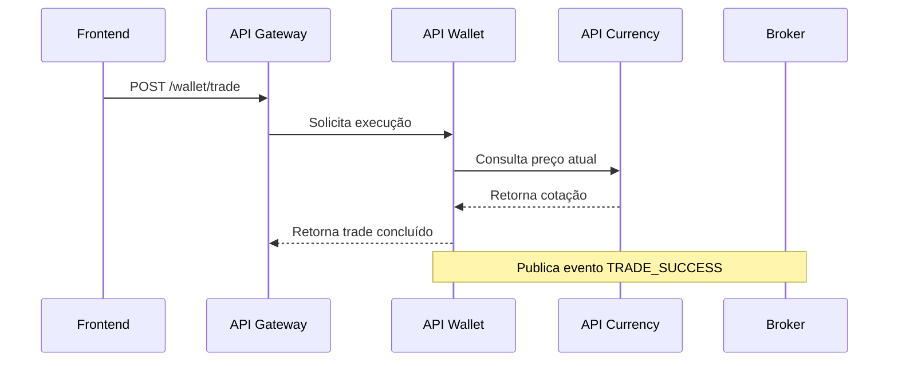
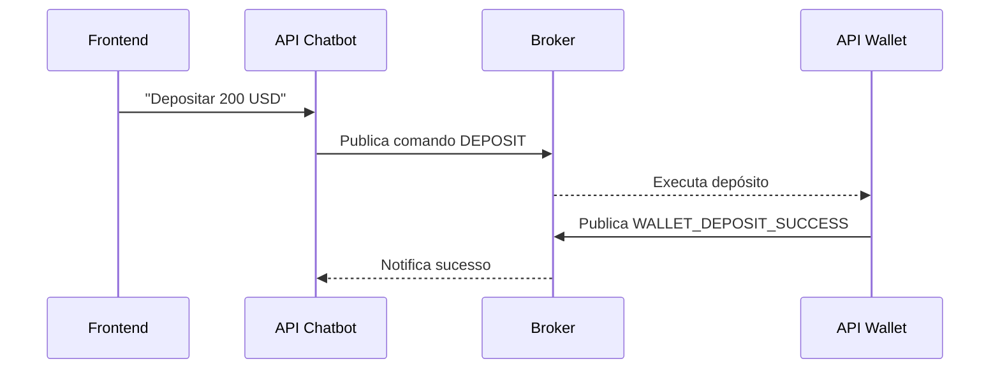

# Projeto Corretora de Criptomoedas

## 1. Visão Geral do Projeto

O projeto interdisciplinar tem como objetivo o **desenvolvimento de uma aplicação multiplataforma** inspirada em corretoras de criptomoedas, como a Binance.

O sistema deve permitir **autenticação de usuários**, **exibição de carteiras e ativos**, **simulação de transações** (depósitos, saques e trocas) e **interação via chatbot**, integrando **diferentes tecnologias** e **conceitos de sistemas distribuídos**.

A arquitetura baseia-se em **microserviços independentes**, com comunicação síncrona via **API Gateway (REST)** e comunicação assíncrona via **RabbitMQ (mensageria)**.

**Principais tecnologias utilizadas:**

* **Backend:** .NET (C#) com arquitetura limpa (Clean Architecture)
* **Frontend Web:** Next.js + TypeScript + Tailwind CSS
* **Mobile:** React Native com Expo
* **Mensageria:** RabbitMQ
* **Chatbot:** Flask (Python)
* **Banco de dados:** SQLite (nas APIs)
* **Controle de versão:** GitHub com fluxo GitFlow


## 2. Arquitetura da Aplicação

### 2.1 Estrutura Geral

O sistema é composto por **cinco APIs principais** e um **API Gateway**.

| API             | Função principal                                                 |
| --------------- | ---------------------------------------------------------------- |
| **UserAPI**     | Cadastro, autenticação e controle de acesso dos usuários.        |
| **WalletAPI**   | Controle de carteiras, saldos e transações.                      |
| **CurrencyAPI** | Consulta de cotações e histórico de preços de ativos.            |
| **ChatbotAPI**  | Atendimento automatizado e comandos de interação.                |
| **GatewayAPI**  | Camada intermediária entre o frontend/mobile e os microserviços. |

### 2.2 Componentes de Frontend e Mobile

* **Frontend (Next.js + Tailwind CSS):** interface principal de acesso às funcionalidades, exibindo saldo, ativos, histórico e chat.
* **Mobile (React Native + Expo):** versão simplificada e otimizada para acesso rápido a saldo e transações.

### 2.3 Comunicação entre Componentes

* **Síncrona (REST/HTTP):** comunicação direta entre frontend e backend via API Gateway.
* **Assíncrona (RabbitMQ):** troca de mensagens entre microserviços (ex: eventos de depósito, trade, atualização de preços).


## 3. Estrutura de Pastas e Clean Architecture

A arquitetura segue o padrão **Clean Architecture**, garantindo separação de responsabilidades, testabilidade e facilidade de manutenção.

### 3.1 Estrutura Base de um Microserviço

```
/userAPI
  /API
    /Controllers
    /DTOs
    /Configurations
    Program.cs
  /Domain
    /Entities
    /Interfaces
  /Infrastructure
    /Data
    /Repositories
    /Migrations
  /Application
    /Services
    /Interfaces
    /UseCases
```

### 3.2 Camadas da Arquitetura

**1. API (Apresentação)**
Exposição de endpoints REST.
Exemplo: `UserController.cs` responde às requisições de cadastro e login.

**2. Domain (Domínio)**
Contém as entidades e interfaces base do negócio.
Exemplo: `User.cs`, `IUserRepository.cs`.

**3. Infrastructure (Infraestrutura e Persistência)**
Gerencia o banco de dados e implementa os repositórios.
Exemplo: `UserRepository.cs`, `UserDbContext.cs`.

**4. Application (Casos de Uso e Regras de Negócio)**
Implementa a lógica de aplicação, serviços e casos de uso.
Exemplo: `RegisterUserUseCase.cs`, `UserService.cs`.


## 4. Autenticação e Segurança

A autenticação é feita com **JWT (JSON Web Token)**, garantindo que apenas usuários autenticados acessem rotas protegidas.

### 4.1 Dependências utilizadas

```
dotnet add package Microsoft.AspNetCore.Authentication.JwtBearer
dotnet add package BCrypt.Net-Next
```

### 4.2 Fluxo de Autenticação

1. O usuário realiza login enviando e-mail e senha.
2. A API valida as credenciais e gera um **token JWT**.
3. O frontend armazena o token e o envia no cabeçalho das próximas requisições.
4. O token é validado em cada chamada por middleware de autenticação.

### 4.3 Exemplo de Login

**Request**

```json
POST /user/login
{
  "email": "user@example.com",
  "password": "123456"
}
```

**Response**

```json
{
  "token": "eyJhbGciOiJIUzI1NiIsInR5cCI...",
  "mfaRequired": true,
  "mfaType": "sms"
}
```

### 4.4 Hash de Senhas

Na criação do usuário, a senha deve ser armazenada de forma segura:

```csharp
var hashedPassword = BCrypt.Net.BCrypt.HashPassword(userDto.Password);
```


## 5. Comunicação entre Serviços

Os microserviços se comunicam de duas formas:

### 5.1 Comunicação Síncrona (REST via GatewayAPI)

Usada em fluxos que exigem resposta imediata.

**Exemplos:**

* Login (`POST /user/login`)
* Consulta de saldo (`GET /wallet/balance`)
* Execução de trade (`POST /wallet/trade`)
* Envio de mensagem ao chatbot (`POST /chatbot/message`)

**Exemplo de resposta resumida:**

```json
{
  "tradeId": "t98765",
  "status": "SUCCESS",
  "newBalances": { "BTC": 0.5, "USDT": 13750.20 }
}
```

### 5.2 Comunicação Assíncrona (RabbitMQ)

Usada para eventos internos entre serviços, sem depender de resposta imediata.

**Principais Exchanges e eventos:**

| Origem      | Evento                   | Destino         | Ação                         |
| ----------- | ------------------------ | --------------- | ---------------------------- |
| UserAPI     | `user.auth.success`      | Wallet, Chatbot | Registro de login concluído  |
| WalletAPI   | `wallet.deposit.success` | User, Chatbot   | Notificação de depósito      |
| CurrencyAPI | `currency.price.update`  | Wallet, Chatbot | Atualização de preços        |
| ChatbotAPI  | `chatbot.wallet.deposit` | Wallet          | Comando de depósito via chat |

### 5.3 Fluxo de Trade de Ativos



### 5.4 Fluxo de Depósito via Chatbot



## 6. Requisitos Funcionais e Não Funcionais (detalhado)

### 6.1 Requisitos Funcionais (RF)

Cada RF está numerado para referência nas entregas e testes.

**RF-01 — Cadastro de usuário**

* Permitir que um usuário crie conta com `nome`, `email` e `senha`.
* Validar unicidade de `email`.
* Armazenar senha hasheada (BCrypt).

**RF-02 — Autenticação**

* Login via `email` + `senha`.
* Emissão de **JWT** com validade configurável.
* Suporte a MFA (campo `mfaRequired` no payload). Implementação mínima: simulação com `sms` flag (não é preciso integrar SMS real; pode ser flag simulada para entrega).

**RF-03 — Consulta de saldo**

* Exibir saldo total e saldos por carteira (`spot`, `funding`, `overview`).
* Endpoint: `GET /wallet/balance?userId={id}` (autenticado).

**RF-04 — Simulação de depósito/saque**

* Executar depósito fictício em carteira selecionada.
* Publicar evento de depósito (`wallet.deposit.success`) no broker.
* Endpoint: `POST /wallet/deposit`.

**RF-05 — Trade (troca de ativos)**

* Permitir troca entre dois ativos (ex: `BTC → USDT`) com verificação de saldo.
* Consultar preço atual na `CurrencyAPI`.
* Registrar transação e publicar evento `wallet.trade.success`.

**RF-06 — Exibição de ativos populares e gráfico histórico**

* `GET /currency/list` — listar ativos populares.
* `GET /currency/history?symbol={}` — retornar históricos (últimas 24h, 7d) para plotagem no frontend.

**RF-07 — Chatbot (comandos e consultas)**

* `POST /chatbot/message` — responde consultas (ex: "Qual meu saldo?") e aceita comandos simulados (ex: "Depositar 200 USD").
* Chatbot publica comandos no broker para ações que afetam outras APIs.

**RF-08 — Perfil do usuário**

* Endpoint para leitura/atualização de dados não sensíveis (nome, preferências).
* Endpoint protegido para upload de avatar (opcional, armazenar referência).

**RF-09 — Histórico e extrato**

* `GET /wallet/history?userId={}` — lista de transações (depósitos, saques, trades).

**RF-10 — Logs e auditoria (mínimo)**

* Registrar operações sensíveis (login, trade, depósito) em log acessível para avaliação (arquivo ou tabela simples).


### 6.2 Requisitos Não Funcionais (RNF)

**RNF-01 — Desempenho**

* Tempo de resposta médio para endpoints principais (`/wallet/balance`, `/currency/price`) ≤ 1s em ambiente de testes local/avaliativo.

**RNF-02 — Segurança**

* Senhas armazenadas com bcrypt.
* JWT com assinatura HMAC (ou RSA se preferirem) e expiração.
* Rotas protegidas por middleware de autenticação.
* Validação de entrada (sanitização) em todos os endpoints.

**RNF-03 — Escalabilidade**

* Arquitetura baseada em microserviços; componentes desacoplados via RabbitMQ.
* Configurações para permitir execução em contêineres (Docker) — containers separados por serviço.

**RNF-04 — Manutenibilidade**

* Padrão de camadas (Clean Architecture).
* Documentação mínima por serviço: README com endpoints, dependências e rota de execução local.

**RNF-05 — Observabilidade**

* Logs estruturados (pelo menos console + arquivo).
* Métricas simples (contadores de requisições e latência) ou prints no ambiente de avaliação.

**RNF-06 — Portabilidade / Deploy**

* Aplicações devem rodar localmente com `dotnet run` (APIs) e `npm run dev` (frontend) e, preferivelmente, via Docker Compose para avaliação integrada.

**RNF-07 — Tolerância a falhas**

* Em caso de falha de um consumidor RabbitMQ, eventos devem ser reencaminhados / mantidos na fila (configuração básica de retry/ack).


### 6.3 Modelos de Dados (resumo mínimo)

**User**

```json
{
  "id": "u123",
  "name": "André Souza",
  "email": "andre@example.com",
  "passwordHash": "<bcrypt>",
  "createdAt": "2025-09-01T12:00:00Z"
}
```

**WalletBalance**

```json
{
  "userId": "u123",
  "totalBalance": 15200.50,
  "currency": "USD",
  "wallets": [
    { "type": "spot", "balance": 8500.00 },
    { "type": "funding", "balance": 4700.50 },
    { "type": "overview", "balance": 2000.00 }
  ]
}
```

**Trade**

```json
{
  "tradeId": "t98765",
  "userId": "u123",
  "fromAsset": "BTC",
  "toAsset": "USDT",
  "amount": 1.0,
  "executedPrice": 27500.40,
  "status": "SUCCESS",
  "timestamp": "2025-09-19T15:05:00Z"
}
```


## 7. Definição do MVP (Produto Mínimo Viável) — critérios, escopo e checklist de aceitação

### 7.1 Objetivo do MVP

Entregar um conjunto mínimo de funcionalidades completo e integrável que permita demonstrar o fluxo principal de uma corretora simulada: autenticar usuário, exibir saldo, executar depósito/ trade e receber confirmação via chat ou eventos.

### 7.2 Escopo mínimo do MVP (must-have)

Os itens abaixo são obrigatórios para considerar o MVP funcional:

**MVP-01 — Autenticação**

* `POST /user/register`
* `POST /user/login` → retorno de JWT
* Middleware de proteção de rotas no GatewayAPI

**MVP-02 — Consulta de saldo**

* `GET /wallet/balance` autenticado

**MVP-03 — Depósito simulado**

* `POST /wallet/deposit` atualiza saldo e publica `wallet.deposit.success` no RabbitMQ

**MVP-04 — Trade funcional**

* `POST /wallet/trade` valida saldo, consulta preço em `CurrencyAPI` e atualiza saldos
* Publica evento `wallet.trade.success`

**MVP-05 — CurrencyAPI básico**

* `GET /currency/price?symbol={}` retorna preço atual (pode ser dados simulados atualizados a cada X segundos)

**MVP-06 — Chatbot básico**

* `POST /chatbot/message` com respostas a consulta de saldo e comando `Depositar {valor} USD` (que publica `chatbot.wallet.deposit`)

**MVP-07 — Frontend mínimo**

* Páginas: Login, Home (saldo), Trade (formulário simplificado), Chat (UI para testar chatbot)

**MVP-08 — Documentação mínima**

* README geral com instruções de execução do sistema integrado e script de demonstração


### 7.3 Critérios de Aceitação do MVP (detalhados)

Para cada item do MVP existem critérios que definem aprovação:

**Autenticação**

* Ao registrar e logar, o usuário recebe token JWT válido.
* Rota protegida retorna 401 quando JWT ausente ou inválido.

**Consulta de saldo**

* Requisição autenticada retorna `totalBalance` consistente com depósitos/trades realizados na sessão de teste.

**Depósito**

* `POST /wallet/deposit` atualiza saldo e, ao consultar `/wallet/balance`, o valor refletido deve conter o depósito.
* Evento `wallet.deposit.success` é publicado (verificado por consumer simples ou log).

**Trade**

* Trade recusa se saldo insuficiente (retorno HTTP 400 e mensagem clara).
* Em caso de sucesso, saldos atualizados e evento `wallet.trade.success` publicado.

**Chatbot**

* Mensagem "Qual meu saldo?" retorna resposta textual com o saldo atual (usando dados da WalletAPI).
* Comando "Depositar 200 USD" gera evento `chatbot.wallet.deposit` e resulta em alteração de saldo após processamento.

**Frontend**

* Usuário consegue autenticar, ver saldo, abrir trade e enviar mensagens ao chatbot (apesar de UI simples).


### 7.4 Endpoints mínimos recomendados (resumo)

* `POST /user/register`
* `POST /user/login`
* `GET /wallet/balance`
* `POST /wallet/deposit`
* `POST /wallet/trade`
* `GET /currency/price`
* `GET /currency/history` (opcional básico)
* `POST /chatbot/message`


### 7.5 Métricas para considerar o MVP aceitável (para avaliação)

* **Funcionalidade:** 100% dos endpoints MVP respondendo conforme critérios de aceitação.
* **Integração:** Eventos básicos publicados e consumidos (depósito e trade).
* **Documentação:** README com passos de execução e script de demo.
* **Usabilidade:** Frontend navegável para demonstração (login → saldo → deposit → trade → chat).
* **Robustez:** Tratamento básico de erros (400/401/500 com mensagens claras).


### 7.6 Checklist técnico para entrega do MVP (para subir no repositório)

* [ ] Repositório principal com README geral.
* [ ] Subpastas / repositórios por serviço com README e instruções de execução.
* [ ] Arquivo `docker-compose.yml` (opcional, mas recomendado) contendo: RabbitMQ, UserAPI, WalletAPI, CurrencyAPI, ChatbotAPI e Frontend (ou instruções para rodar localmente).
* [ ] Script ou documento `DEMO.md` com os passos para apresentação (ex.: criar usuário → login → depositar → executar trade → verificar eventos).
* [ ] Mapeamento de dependências e versões no README (ex.: dotnet SDK version, Node version).
* [ ] Rota de execução rápida: comandos exatos para executar cada serviço localmente.
* [ ] Branch final nomeada (ex.: `deliver/mvp`) ou tag com a versão entregue.


### 7.7 Riscos conhecidos e mitigação (curto)

* **Risco:** Falta de tempo para integrar RabbitMQ.
  **Mitigação:** Implementar publicação em log e simular consumo; documentar onde o consumo real deve acontecer.
* **Risco:** Dados de preço real não disponíveis.
  **Mitigação:** Usar dataset estático ou gerador de preços simulados (script que atualiza preços a cada X segundos).
* **Risco:** Problemas de autenticação cross-service.
  **Mitigação:** Padronizar validação de JWT a partir de um secret/keystore compartilhado no `.env` de avaliação.


## 8. Padrão de Documentação Exigido

Cada grupo deverá manter um **padrão de documentação técnica unificado** entre os microserviços, seguindo boas práticas de repositórios profissionais.
A documentação faz parte da nota final e será avaliada em conjunto com o código e a apresentação.

Além dos arquivos de documentação no formato **Markdown (`.md`)**, cada grupo deverá **gerar uma documentação técnica adicional em PDF**, nomeada:

```
Documentacao_Tecnica_Projeto_Corretora.pdf
```


Esse documento deverá conter os **diagramas essenciais do projeto**, acompanhados de uma **breve explicação textual** de cada um, com o objetivo de evidenciar o entendimento técnico do grupo sobre a arquitetura e o funcionamento do sistema.

### Elementos obrigatórios da documentação técnica em PDF

**1. Diagrama de Arquitetura Geral do Sistema**
Deve representar graficamente a visão macro da aplicação, destacando:

* O **Frontend (Next.js)** e o **aplicativo mobile (React Native)** como camadas de interface.
* O **API Gateway**, responsável por intermediar o tráfego entre os clientes e os microserviços.
* Os **microserviços principais** (`UserAPI`, `WalletAPI`, `CurrencyAPI`, `ChatbotAPI`), com suas responsabilidades.
* O **mecanismo de mensageria (RabbitMQ)**, indicando os fluxos assíncronos de eventos.
* A **persistência de dados** (bancos SQLite ou outros) associada a cada serviço.
  O diagrama deve deixar evidente como ocorre a comunicação entre os componentes (REST e eventos) e como as camadas se integram.


**2. Diagramas de Classes (UML) — por microserviço**
Cada microserviço deverá possuir um diagrama de classes UML simplificado, contendo:

* **Entidades (models)**: classes que representam as tabelas do domínio (ex.: `User`, `Wallet`, `Currency`).
* **Serviços (services)**: classes que implementam regras de negócio (ex.: `UserService`, `WalletService`).
* **Repositórios (repositories)**: classes responsáveis pela persistência e acesso a dados.
* **Interfaces (contracts)**: definindo os métodos esperados de serviços e repositórios.

Cada diagrama deve conter:

* Atributos principais de cada classe (sem necessidade de todos os tipos).
* Relacionamentos entre classes (associações, dependências, heranças, etc.).
* Uma breve legenda explicando as camadas (Application, Domain, Infrastructure).


**3. DER — Diagrama Entidade-Relacionamento (por API)**
Cada microserviço com persistência própria deve apresentar seu **modelo de dados relacional**:

* Identificação das **entidades (tabelas)** e seus atributos essenciais.
* Indicação das **chaves primárias e estrangeiras**.
* Relacionamentos entre entidades (1:N, N:N, 1:1).
* Cardinalidades e dependências entre dados (ex.: um `User` pode ter várias `Wallets`; uma `Wallet` pertence a um único `User`).

O DER deve refletir o modelo efetivamente implementado nas classes de entidade do domínio.


**4. Diagramas de Sequência — fluxos principais**
Os diagramas de sequência devem representar as **interações entre componentes** durante os fluxos centrais do sistema.
Fluxos obrigatórios:

* **Login** → validação do usuário e emissão de token JWT.
* **Depósito** → solicitação REST, processamento na `WalletAPI` e publicação de evento.
* **Trade** → interação entre `WalletAPI` e `CurrencyAPI` para conversão de ativos.
* **Depósito via Chatbot** → comando recebido no `ChatbotAPI`, publicado no RabbitMQ e processado pela `WalletAPI`.

Cada diagrama deve apresentar:

* As entidades participantes (Frontend, Gateway, APIs, RabbitMQ).
* As mensagens trocadas (requisições REST, eventos, respostas).
* O resultado final esperado (ex.: saldo atualizado, confirmação de trade).


**5. Fluxo de Comunicação entre Serviços (REST e RabbitMQ)**
Representar de forma consolidada as **rotas síncronas (HTTP)** e **eventos assíncronos (RabbitMQ)** do sistema.
O diagrama pode combinar setas diretas (REST) e setas tracejadas (eventos).
Deve ilustrar:

* Principais endpoints utilizados entre serviços (ex.: `/wallet/trade`, `/currency/price`).
* Exchanges e routing keys usadas no RabbitMQ (ex.: `wallet.events`, `chatbot.commands`).
* Direção das mensagens e dependências entre os microserviços.


**6. Descrição textual dos componentes e tecnologias**
Após os diagramas, incluir uma seção descritiva com:

* O papel de cada componente (ex.: GatewayAPI, UserAPI, WalletAPI etc.).
* A tecnologia utilizada em cada camada (linguagem, frameworks, banco de dados, mensageria).
* As principais decisões de design adotadas (ex.: uso de Clean Architecture, comunicação assíncrona, token JWT).
* Versões e dependências mais relevantes.


Ela servirá como **complemento visual e explicativo da documentação em Markdown**, sendo obrigatória para avaliação final.
Todos os diagramas devem ser originais, elaborados pelo grupo (pode-se utilizar ferramentas como Draw.io, Lucidchart, PlantUML ou Mermaid).

### 8.1 Estrutura Geral de Repositório

Cada grupo poderá usar:

* **1 repositório monolítico (monorepo)** com subpastas `/userAPI`, `/walletAPI`, `/currencyAPI`, etc.
  ou
* **Vários repositórios** (um por microserviço) vinculados a uma organização no GitHub.

Em ambos os casos, é **obrigatório** incluir:

```
ProjetoCorretora/
│
├── README.md                    # Documentação geral do sistema
├── Documentacao_Tecnica_Projeto_Corretora.pdf  # Documento técnico com diagramas
├── docker-compose.yml            # Opcional, mas recomendado
├── /userAPI/                     # Serviço de autenticação
│   ├── README.md
│   └── ...
├── /walletAPI/                   # Serviço de carteiras
│   ├── README.md
│   └── ...
├── /currencyAPI/                 # Serviço de cotações
│   ├── README.md
│   └── ...
├── /chatbotAPI/                  # Serviço do chatbot
│   ├── README.md
│   └── ...
├── /frontend/                    # Aplicação web (Next.js)
│   ├── README.md
│   └── ...
└── DEMO.md                       # Passo a passo de execução e apresentação
```


### 8.2 Estrutura mínima de cada `README.md` de serviço

Cada serviço deve conter:

#### 1. Identificação

```
# UserAPI
Gerencia usuários e autenticação via JWT.
```

#### 2. Stack e dependências

```
- Linguagem: C# (.NET 8)
- Banco: SQLite
- Mensageria: RabbitMQ
- Autenticação: JWT (Microsoft.AspNetCore.Authentication.JwtBearer)
```

#### 3. Instruções de execução local

```
dotnet restore
dotnet run
```

ou, se via Docker:

```
docker build -t userapi .
docker run -p 8080:8080 userapi
```

#### 4. Endpoints principais

| Método | Endpoint       | Descrição                     |
| ------ | -------------- | ----------------------------- |
| POST   | /user/register | Criação de novo usuário       |
| POST   | /user/login    | Retorna JWT                   |
| GET    | /user/profile  | Perfil do usuário autenticado |

#### 5. Exemplos de Requisição/Resposta

```json
POST /user/login
{
  "email": "teste@example.com",
  "password": "123456"
}
```

**Response:**

```json
{
  "token": "eyJh...abc",
  "expiresIn": 3600
}
```

#### 6. Integrações com outros serviços

* Publica evento `user.auth.success` no RabbitMQ.
* Consumido por `WalletAPI` e `ChatbotAPI`.

#### 7. Observações / Known Issues

Anotar limitações conhecidas ou endpoints simulados.


### 8.3 Documentação geral do sistema (`README.md` da raiz)

O documento principal do projeto deve conter:

1. **Visão geral da aplicação e arquitetura.**
2. **Serviços existentes e suas funções.**
3. **Como executar o projeto completo** (localmente ou via Docker Compose).
4. **Fluxos principais de uso** (Login → Depósito → Trade → Chatbot).
5. **Integrantes do grupo e responsabilidades.**
6. **Versões das tecnologias** (dotnet SDK, Node, etc.).
7. **Descrição do ambiente de testes** e instruções para o avaliador.

Exemplo de seção de execução integrada:

```
# Execução via Docker Compose
docker-compose up -d
```


### 8.4 Documento de Demonstração (`DEMO.md`)

Deve conter o **roteiro da apresentação final**, com os comandos e passos de teste na ordem esperada.
Exemplo:

```
## Passo 1 – Registro e login
POST /user/register
POST /user/login → copiar token JWT

## Passo 2 – Consultar saldo inicial
GET /wallet/balance

## Passo 3 – Realizar depósito
POST /wallet/deposit { "amount": 1000 }

## Passo 4 – Executar trade
POST /wallet/trade { "from": "BTC", "to": "USDT", "amount": 0.5 }

## Passo 5 – Chatbot
POST /chatbot/message "Qual meu saldo?"
```


### 8.5 Padrão de Commits e Branches

Para manter o histórico organizado e rastreável, adotar convenção semelhante a:

```
feat(auth): adicionar autenticação JWT
fix(wallet): corrigir cálculo de saldo após depósito
docs(readme): atualizar instruções de execução
refactor(api): reorganizar estrutura de diretórios
```

Branch principal: `main`
Branchs de desenvolvimento: `feature/`, `fix/`, `hotfix/`, `release/`
Branch final para entrega: `deliver/mvp` ou `main` com tag `v1.0-final`.


### 8.6 Padrão de Avaliação Técnica da Documentação

Durante a correção, serão observados:

| Critério                     | Peso | Descrição                                       |
| ---------------------------- | ---- | ----------------------------------------------- |
| Estrutura de pastas coerente | 1.0  | Pastas e serviços bem organizados               |
| README por serviço           | 1.0  | Instruções e endpoints claros                   |
| README geral e DEMO.md       | 1.0  | Documentação do sistema completo                |
| Histórico de commits claros  | 0.5  | Histórico descritivo e padronizado              |
| Fluxos e comandos testáveis  | 0.5  | Comandos reproduzíveis no ambiente do avaliador |

**Pontuação total (documentação): 4,0 pontos** dentro da nota global.


## 9. Critérios de Avaliação Final

A avaliação final será composta pela **entrega técnica (código e documentação)** e pela **apresentação prática do MVP**, conforme rubrica a seguir.

### 9.1 Estrutura de Avaliação

| Dimensão                                  | Peso        | Descrição                                                                            |
| ----------------------------------------- | ----------- | ------------------------------------------------------------------------------------ |
| **1. Funcionalidade (execução)**          | **3,0 pts** | APIs e frontend funcionando conforme MVP, com fluxo principal executável.            |
| **2. Arquitetura e qualidade do código**  | **2,0 pts** | Aplicação modular, camadas respeitando Clean Architecture, boas práticas de C# e JS. |
| **3. Integração e mensageria (RabbitMQ)** | **1,5 pts** | Publicação e/ou consumo de eventos entre microserviços, mesmo que simulada.          |
| **4. Documentação técnica**               | **2,0 pts** | READMEs completos, comandos funcionais, descrição do sistema clara.                  |
| **5. Apresentação e domínio do grupo**    | **1,5 pts** | Clareza na explicação do projeto, roteiro coerente, respostas técnicas seguras.      |

**Total: 10,0 pontos**


### 9.2 Descritivo dos níveis de desempenho

**Excelente (9–10):**

* Sistema completo, todos endpoints MVP funcionando.
* Integração RabbitMQ funcional ou simulada e documentada.
* Documentação clara e reproduzível.
* Apresentação segura e domínio dos conceitos de arquitetura, comunicação e autenticação.

**Bom (7–8):**

* MVP funcional com pequenas falhas isoladas.
* RabbitMQ implementado parcialmente ou via logs.
* Documentação suficiente, mas com lacunas menores.
* Boa compreensão técnica do grupo.

**Regular (5–6):**

* MVP parcialmente implementado.
* Falhas em integração ou inconsistência de dados.
* Documentação incompleta.
* Apresentação superficial ou leitura excessiva de roteiro.

**Insuficiente (≤4):**

* Sistema não executa o fluxo principal completo (login → saldo → trade).
* Falta de documentação ou código fora do padrão.
* Dificuldade em explicar arquitetura ou decisões de projeto.


### 9.3 Requisitos obrigatórios para avaliação

Para que o projeto seja avaliado, **todos os itens abaixo devem estar presentes**:

* Repositório acessível e público ou compartilhado com a coordenação.
* README geral + READMEs por serviço.
* MVP executável (localmente ou via Docker Compose).
* Passo a passo de demonstração (arquivo `DEMO.md`).
* Código-fonte entregue até a data limite.
* Apresentação oral com tempo máximo de 10 a 12 minutos.


### 9.4 Recomendações finais aos alunos

* Priorize **funcionalidade e integração** antes da interface.
* Documente **cada endpoint testado** (exemplo de request e response).
* Em caso de falha em um serviço, **explique tecnicamente** na apresentação (não omita).
* Mantenha **logs ativados e visíveis** na execução (para que o avaliador veja eventos e chamadas REST).
* Prepare **ambiente limpo** para a demonstração (exemplo: containers zerados, banco ressetado).