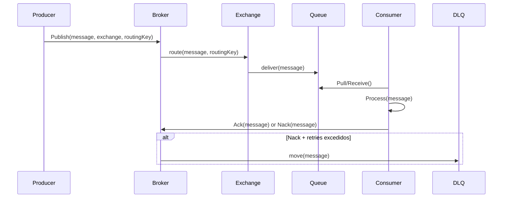

# 1. Visão geral (propósito didático)

Queremos uma implementação **simples, modular e testável** que permita demonstrar:

* Exchanges (Direct / Fanout / Topic)
* Filas com entrega FIFO
* Bindings (exchange -> queue) com routing keys
* Produtor publica mensagens em uma exchange
* Consumidor se conecta a uma fila e processa mensagens, confirmando (ack) ou rejeitando (nack)
* Dead-Letter Queue (DLQ) para mensagens que falham repetidamente
* Persistência opcional (arquivo) para sobrevivência simples

Arquitetura em camadas:

* **Core**: interfaces e modelos (IMessage, IQueue, IExchange, IBroker)
* **Infra**: implementações (InMemoryQueue, InMemoryExchange, FilePersistence)
* **Services**: Producer, Consumer, Router/Dispatcher
* **App**: Console apps de exemplo (producer/consumer) e testes

# 2. Diagrama de sequência (Mermaid)



# 3. Estrutura de projeto (sugestão)

```
MyMiniBroker/
 ├─ src/
 │  ├─ Core/           (interfaces, models)
 │  ├─ Infra/          (in-memory queue/exchange, persistence)
 │  ├─ Services/       (broker, router, producer/consumer helpers)
 │  └─ Apps/
 │     ├─ ProducerApp/
 │     └─ ConsumerApp/
 └─ tests/
```

# 4. Código (implementação mínima)

Abaixo um conjunto de arquivos que formam a implementação mínima — cole em um projeto console (`dotnet new console -o MyMiniBroker`) e adicione classes conforme indicado.

## Models e interfaces (Core)

```csharp
// IMessage.cs
public interface IMessage
{
    Guid Id { get; }
    string RoutingKey { get; }
    byte[] Body { get; }
    int DeliveryCount { get; set; } // para retries
    DateTime CreatedAt { get; }
}

// Message.cs
public class Message : IMessage
{
    public Guid Id { get; } = Guid.NewGuid();
    public string RoutingKey { get; }
    public byte[] Body { get; }
    public int DeliveryCount { get; set; } = 0;
    public DateTime CreatedAt { get; } = DateTime.UtcNow;

    public Message(string routingKey, byte[] body)
    {
        RoutingKey = routingKey;
        Body = body;
    }

    public override string ToString() => $"Message(Id={Id}, RoutingKey={RoutingKey}, DeliveryCount={DeliveryCount})";
}

// ExchangeType.cs
public enum ExchangeType { Direct, Fanout, Topic }
```

## Filas e Exchanges (Infra)

```csharp
// IQueue.cs
public interface IQueue
{
    string Name { get; }
    Task EnqueueAsync(IMessage message);
    Task<IMessage?> DequeueAsync(CancellationToken ct);
    int Count { get; }
}

// InMemoryQueue.cs
using System.Collections.Concurrent;
public class InMemoryQueue : IQueue
{
    private readonly ConcurrentQueue<IMessage> _q = new();
    private readonly SemaphoreSlim _signal = new(0);

    public string Name { get; }
    public int Count => _q.Count;

    public InMemoryQueue(string name) => Name = name;

    public Task EnqueueAsync(IMessage message)
    {
        _q.Enqueue(message);
        _signal.Release();
        return Task.CompletedTask;
    }

    public async Task<IMessage?> DequeueAsync(CancellationToken ct)
    {
        await _signal.WaitAsync(ct);
        _q.TryDequeue(out var msg);
        return msg;
    }
}

// IExchange.cs
public interface IExchange
{
    string Name { get; }
    ExchangeType Type { get; }
    void BindQueue(string routingKey, IQueue queue); // simple binding by key
    void UnbindQueue(string routingKey, IQueue queue);
    Task RouteAsync(IMessage message);
}

// InMemoryExchange.cs
public class InMemoryExchange : IExchange
{
    public string Name { get; }
    public ExchangeType Type { get; }

    // routingKey -> list of queues
    private readonly ConcurrentDictionary<string, ConcurrentBag<IQueue>> _bindings = new();

    public InMemoryExchange(string name, ExchangeType type)
    {
        Name = name;
        Type = type;
    }

    public void BindQueue(string routingKey, IQueue queue)
    {
        var bag = _bindings.GetOrAdd(routingKey ?? string.Empty, _ => new ConcurrentBag<IQueue>());
        bag.Add(queue);
    }

    public void UnbindQueue(string routingKey, IQueue queue)
    {
        // simple approach: no removal from bag (didactic). Could store ConcurrentDictionary<string,List<IQueue>> for removals.
    }

    public async Task RouteAsync(IMessage message)
    {
        if (Type == ExchangeType.Fanout)
        {
            // deliver to all queues across all bindings
            foreach (var kv in _bindings)
            {
                foreach (var q in kv.Value)
                    await q.EnqueueAsync(message);
            }
            return;
        }

        if (Type == ExchangeType.Direct)
        {
            if (_bindings.TryGetValue(message.RoutingKey, out var bag))
            {
                foreach (var q in bag)
                    await q.EnqueueAsync(message);
            }
            return;
        }

        if (Type == ExchangeType.Topic)
        {
            // naive topic matching: support * and # can be implemented; for didactic keep direct match
            if (_bindings.TryGetValue(message.RoutingKey, out var bag2))
            {
                foreach (var q in bag2)
                    await q.EnqueueAsync(message);
            }
            return;
        }
    }
}
```

## Broker e gerenciamento (Services)

```csharp
// IBroker.cs
public interface IBroker
{
    IExchange DeclareExchange(string name, ExchangeType type);
    IQueue DeclareQueue(string name);
    void Bind(string exchangeName, string routingKey, string queueName);
    Task PublishAsync(string exchangeName, IMessage message);
    IQueue? GetQueue(string name);
    IExchange? GetExchange(string name);
}

// Broker.cs
public class Broker : IBroker
{
    private readonly ConcurrentDictionary<string, IExchange> _exchanges = new();
    private readonly ConcurrentDictionary<string, IQueue> _queues = new();

    // For dead-lettering control
    public string DeadLetterQueueName { get; } = "DLQ";

    public Broker()
    {
        // create default DLQ
        DeclareQueue(DeadLetterQueueName);
    }

    public IExchange DeclareExchange(string name, ExchangeType type)
    {
        return _exchanges.GetOrAdd(name, _ => new InMemoryExchange(name, type));
    }

    public IQueue DeclareQueue(string name)
    {
        return _queues.GetOrAdd(name, _ => new InMemoryQueue(name));
    }

    public void Bind(string exchangeName, string routingKey, string queueName)
    {
        var ex = DeclareExchange(exchangeName, ExchangeType.Direct);
        var q = DeclareQueue(queueName);
        ex.BindQueue(routingKey, q);
    }

    public async Task PublishAsync(string exchangeName, IMessage message)
    {
        if (!_exchanges.TryGetValue(exchangeName, out var ex))
            throw new InvalidOperationException($"Exchange {exchangeName} not found");

        await ex.RouteAsync(message);
    }

    public IQueue? GetQueue(string name) => _queues.TryGetValue(name, out var q) ? q : null;
    public IExchange? GetExchange(string name) => _exchanges.TryGetValue(name, out var ex) ? ex : null;

    // helper to move to DLQ
    public Task MoveToDeadLetterAsync(IMessage msg)
    {
        var dlq = GetQueue(DeadLetterQueueName)!;
        return dlq.EnqueueAsync(msg);
    }
}
```

## Consumer (processamento e ack)

```csharp
// Consumer.cs
public class Consumer
{
    private readonly IBroker _broker;
    private readonly IQueue _queue;
    private readonly Func<IMessage, Task<bool>> _processor; // returns true if ack, false if nack
    private readonly int _maxRetries;

    public Consumer(IBroker broker, string queueName, Func<IMessage, Task<bool>> processor, int maxRetries = 3)
    {
        _broker = broker;
        _queue = broker.GetQueue(queueName) ?? throw new ArgumentException("Queue not found");
        _processor = processor;
        _maxRetries = maxRetries;
    }

    public async Task StartAsync(CancellationToken ct)
    {
        while (!ct.IsCancellationRequested)
        {
            var msg = await _queue.DequeueAsync(ct);
            if (msg == null) continue;

            try
            {
                var success = await _processor(msg);
                if (!success)
                {
                    msg.DeliveryCount++;
                    if (msg.DeliveryCount > _maxRetries)
                    {
                        await _broker.MoveToDeadLetterAsync(msg);
                        Console.WriteLine($"Moved to DLQ: {msg.Id}");
                    }
                    else
                    {
                        // re-enqueue with backoff (simple)
                        await Task.Delay(500);
                        await _queue.EnqueueAsync(msg);
                        Console.WriteLine($"Requeued message {msg.Id}, deliveryCount={msg.DeliveryCount}");
                    }
                }
                else
                {
                    // ack - nothing to do in our in-memory model
                    Console.WriteLine($"Processed and acked {msg.Id}");
                }
            }
            catch (Exception ex)
            {
                // treat as nack
                msg.DeliveryCount++;
                Console.WriteLine($"Processor threw: {ex.Message}. deliveryCount={msg.DeliveryCount}");
                if (msg.DeliveryCount > _maxRetries)
                    await _broker.MoveToDeadLetterAsync(msg);
                else
                    await _queue.EnqueueAsync(msg);
            }
        }
    }
}
```

## Producer (simples)

```csharp
// Producer.cs
public class Producer
{
    private readonly IBroker _broker;
    public Producer(IBroker broker) => _broker = broker;

    public Task SendAsync(string exchange, string routingKey, string payload)
    {
        var msg = new Message(routingKey, System.Text.Encoding.UTF8.GetBytes(payload));
        return _broker.PublishAsync(exchange, msg);
    }
}
```

## Exemplo de uso (Program.cs)

```csharp
using System.Threading;

class Program
{
    static async Task Main()
    {
        var broker = new Broker();

        // declare exchange and queues
        var ex = broker.DeclareExchange("amq.direct", ExchangeType.Direct);
        var qName = "task_queue";
        broker.DeclareQueue(qName);
        broker.Bind("amq.direct", "task", qName);

        var producer = new Producer(broker);

        // start consumer
        var cts = new CancellationTokenSource();
        var consumer = new Consumer(broker, qName, async (msg) =>
        {
            var body = System.Text.Encoding.UTF8.GetString(msg.Body);
            Console.WriteLine($"Consumer got: {body}");
            // simulate occasional failure
            if (body.Contains("fail") && msg.DeliveryCount < 1)
            {
                Console.WriteLine("Simulating failure");
                return false; // nack to force retry
            }
            await Task.Delay(200); // process
            return true; // ack
        }, maxRetries: 2);

        var consumerTask = Task.Run(() => consumer.StartAsync(cts.Token));

        // send messages
        await producer.SendAsync("amq.direct", "task", "hello 1");
        await producer.SendAsync("amq.direct", "task", "hello fail");
        await producer.SendAsync("amq.direct", "task", "hello 3");

        Console.WriteLine("Messages published. Press any key to stop after 5s...");
        await Task.Delay(5000);
        cts.Cancel();
        await consumerTask;

        // inspect DLQ
        var dlq = broker.GetQueue(broker.DeadLetterQueueName);
        Console.WriteLine("DLQ count: " + dlq!.Count);
    }
}
```

# 5. Como rodar

1. `dotnet new console -o MyMiniBroker`
2. substitua o `Program.cs` e adicione as demais classes (pode criar pastas Core/Infra/Services) copiando o código acima.
3. `dotnet run` dentro de `MyMiniBroker`.
